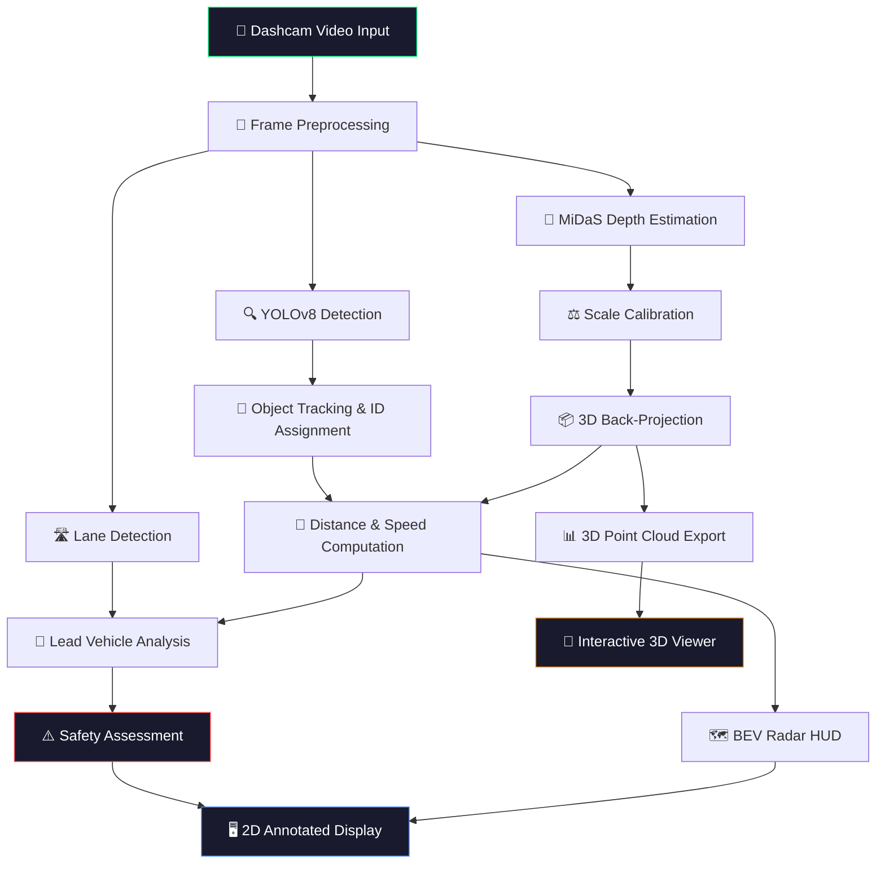

<div align="center">

<!-- Animated Header -->


<!-- Animated Typing -->
<a href="#">
  
</a>

<!-- Badges -->
<br/>


<br/>


</div>

<!-- Animated Divider -->


## 🎯 Overview

> **A production-grade perception pipeline that transforms raw dashcam footage into real-time 3D spatial intelligence for Advanced Driver Assistance Systems.**

This project implements a complete ADAS perception stack using monocular camera input — no LiDAR, no radar, just a single dashcam video. The system performs real-time object detection, depth estimation, 3D bounding box projection, bird's-eye-view visualization, and collision risk assessment.


## ✨ Key Features

<table>
<tr>
<td width="50%">

### 🔍 Detection & Tracking
- **YOLOv8** multi-object detection (cars, trucks, buses, motorcycles, pedestrians, cyclists)
- Persistent **track ID** assignment across frames
- **EMA-smoothed** distance and lateral offset to eliminate jitter

</td>
<td width="50%">

### 📏 Depth & Distance
- **MiDaS** monocular depth estimation
- Geometric **scale calibration** using ground plane
- Real-world **metric distances** in meters
- **Relative speed** computation per tracked object

</td>
</tr>
<tr>
<td width="50%">

### 🗺️ Bird's-Eye-View HUD
- Top-down **BEV radar panel** with semantic styling
- Real-time road surface projection
- **Ego vehicle** indicator with metric grid overlay
- Color-coded vehicle markers by distance zone

</td>
<td width="50%">

### 📦 3D Bounding Boxes
- **Wireframe cuboid** projection onto flat ground plane
- Class-based dimensions (car, truck, bus, etc.)
- Distance-coded colors (🔴 Red → 🟠 Orange → 🔵 Blue)
- Interactive **Open3D viewer** with frame navigation

</td>
</tr>
<tr>
<td width="50%">

### ⚠️ Safety Alerts
- **SAFE GO** / **CRITICAL WARNING** center-top banner
- Flashing red overlay for emergency distances (< 3m)
- Lead vehicle identification with triple-check validation
- Color-coded bounding boxes (🔴 Red < 6m, 🟢 Green ≥ 6m)

</td>
<td width="50%">

### 🛣️ Lane Detection
- White and yellow lane marking detection
- Dynamic **ego-lane boundary** tracking
- Lane-based vehicle classification (In-lane / Adjacent / Oncoming)
- Trapezoid ROI masking for robust detection

</td>
</tr>
</table>


## 🏗️ System Architecture




## 🚀 Quick Start

### Prerequisites

```bash
Python 3.10+
pip install ultralytics opencv-python torch open3d numpy
```

### 1️⃣ Clone the Repository

```bash
git clone https://github.com/harsh5d5/ADAS_Advanced-driver-assistance-system.git
cd ADAS-System
```

### 2️⃣ Run the 2D ADAS HUD (Live Detection + BEV Radar)

```bash
python detect_and_hud.py
```

> Press **`q`** in the video window to exit.

### 3️⃣ Generate 3D Point Cloud Data

```bash
python point_cloud_3d.py
```

> This processes the dashcam video and generates `.ply` files with 3D bounding boxes in `output/pointclouds/`.

### 4️⃣ Launch the Interactive 3D Viewer

```bash
python view_pointcloud.py
```

| Key | Action |
|-----|--------|
| `D` / `→` | Next frame |
| `A` / `←` | Previous frame |
| Mouse drag | Rotate view |
| Scroll | Zoom in/out |
| `Q` | Quit |


## 📂 Project Structure

```
ADAS/
├── 📄 detect_and_hud.py       # Main pipeline: detection, tracking, BEV, HUD, safety alerts
├── 📄 point_cloud_3d.py       # 3D bounding box generation & PLY export
├── 📄 view_pointcloud.py      # Interactive Open3D point cloud viewer
├── 📄 .gitignore              # Git exclusions for large media/model files
├── 🎥 ADAS.mp4                # Input dashcam video (not tracked by git)
├── 🤖 yolov8n.pt              # YOLOv8 nano weights (not tracked by git)
└── 📁 output/
    └── 📁 pointclouds/        # Generated .ply files with 3D bounding boxes
```


## 🎨 Visual Outputs

### 2D HUD — Real-Time Detection & Safety Assessment

| Feature | Description |
|---------|-------------|
| 🟢 **Green Box** | Vehicle detected at safe distance (≥ 6m) |
| 🔴 **Red Box** | Vehicle within critical proximity (< 6m) |
| 🟡 **LEAD VEHICLE** | Closest in-lane vehicle tagged with distance label |
| 📊 **BEV Radar** | Top-down bird's-eye-view with semantic road mapping |
| 🏷️ **Status Banner** | Center-top **SAFE GO** or flashing **CRITICAL WARNING** |

### 3D Visualization — Interactive Point Cloud Viewer

| Feature | Description |
|---------|-------------|
| ⬜ **Ground Grid** | Dense flat grid at ground level (0.5m spacing) |
| 🔴 **Red Wireframe** | Close object (< 5m) |
| 🟠 **Orange Wireframe** | Medium range (5–10m) |
| 🔵 **Blue Wireframe** | Far object (> 10m) |


## 🔬 Technical Deep-Dive

### Depth Calibration Pipeline

The system uses a **geometric ground-plane calibration** approach to convert MiDaS relative depth into metric distances:

```
Z_geometric = (F_Y × H_CAM) / (v_pixel - v_horizon)
scale_factor = median(Z_geometric / MiDaS_raw)
Z_metric = MiDaS_raw × scale_factor
```

### Lead Vehicle Detection (Triple-Check Validation)

A vehicle is classified as the **lead vehicle** only when ALL three conditions are satisfied:

| Check | Condition | Purpose |
|-------|-----------|---------|
| 🛣️ **Lane Bounds** | `left_lane ≤ x_center ≤ right_lane` | Must be inside ego-lane |
| 📐 **Geometric** | `|X_world| < 1.2m` | Must be directly ahead |
| 🎯 **Frame Center** | `|x_pixel - 640| < 180px` | Rejects far-off detections |

### 3D Bounding Box Projection

Objects are projected into 3D space using pinhole camera geometry with class-based dimensions:

| Class | Length | Width | Height |
|-------|--------|-------|--------|
| Car | 4.0m | 1.8m | 1.5m |
| Truck | 8.0m | 2.5m | 3.0m |
| Bus | 10.0m | 2.5m | 3.2m |
| Motorcycle | 2.0m | 0.8m | 1.2m |


## 💡 Use Cases

<div align="center">

| Use Case | Description |
|----------|-------------|
| 🚨 **Driver Safety Monitoring** | Real-time alerts for collision avoidance |
| 🔍 **Incident Review** | Automated root cause analysis with 3D reconstruction |
| 🤖 **ML Training Data** | Generate labeled 3D bounding boxes from video |
| 🏭 **Fleet ADAS** | Aftermarket safety features for commercial vehicles |
| 🎮 **Simulation** | Scenario replay for autonomous system validation |
| 📈 **Risk Analytics** | Predictive safety metrics for fleet management |

</div>


## 🛠️ Tech Stack

<div align="center">


| Technology | Purpose |
|------------|---------|
| **Python 3.12** | Core language |
| **YOLOv8 (Ultralytics)** | Real-time object detection |
| **MiDaS (Intel)** | Monocular depth estimation |
| **OpenCV** | Video processing, lane detection, HUD rendering |
| **Open3D** | 3D point cloud visualization |
| **PyTorch** | Deep learning inference backend |
| **NumPy** | Numerical computation |

</div>


## 📜 License

This project is licensed under the **MIT License** — see the [LICENSE](LICENSE) file for details.
 
---


</div>
